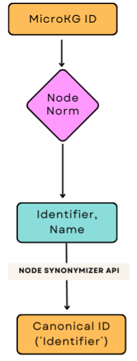
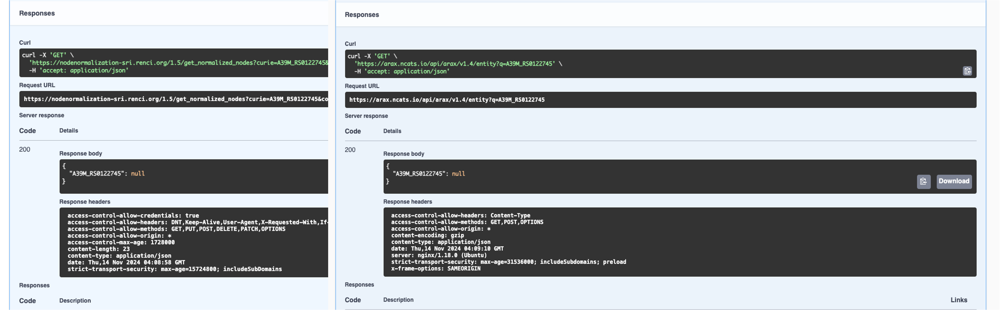
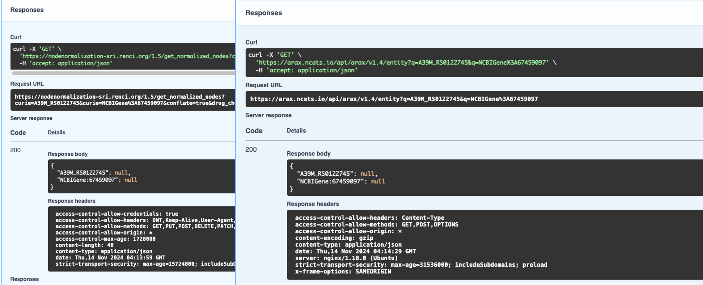

# Microbiome-MetagenomicKG Node Alignment
This is just a temporary repo...

## 1. Node Normalizer (NN)
Below is the overall schematic of node alignment pipeline:

The `id` column from MicrobiomeKG TSV is used to run through **Node Normalization SRI API version 1.5** using the endpoint `/get_normalize_nodes`. The input format is in *JSON*.

__Result__

There were:
* **121 nodes** with No Identifier and Name (KG2 prefered)
* **87 nodes** where the names from MicrobiomeKG do not match with Node Normalized name
* **38 nodes** where the `id` from MicrobiomeKG do not match with NN Identifier. 

## 2. Node Synonymizer (NS)
Next step in the alingment is to use the Identifier and Name (input parameter) from NN step using **ARAX v1.4 API** endpoint `/entity`.
Note: The synonimizer step will be switch with python module with SQLite database. 

__Result__
* Still seeing same problem as NN step.
* There are missing entries in MicrobiomeKG file that couldn't not be verifiable with NN and/NS e.g. prefix EC `name` column is empty
* Even with replacing NN Name input for MicrobiomeKG `name` we still can't yield results. Please refer to images below.

__Problem__
* Can't obtain any result for those 121 nodes with no Identifer and Name (no results)
* MicrobiomeKG has missing entries can't be verifiable.

Example case:

MicrobiomeKG `name`: `A39M_RS0122745`
MicrobiomeKG `id`: `NCBIGene:67459097`

Using MicrobiomeKG `name` for NS

Example case using both `name` and `id`

[NCBI link](https://www.ncbi.nlm.nih.gov/gene/67459097 ) to that curie, courtesy of David Koslicki. It seems like the full name of the gene might be `A39M_RS0122745 phosphoenolpyruvate carboxykinase (GTP)` not just `A39M_RS0122745` gene symbol(?)

The Jupyter Notebook script is provided for reference. 

